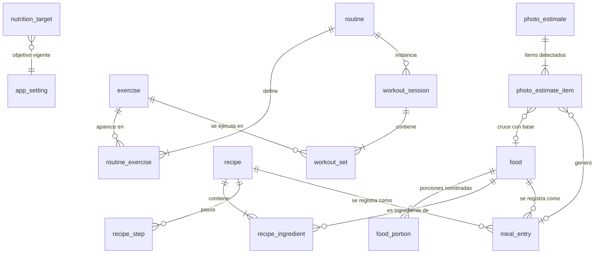

# Modelo de datos

SQLite gestionado con Drift. El DDL de aquí es la fuente de verdad conceptual; las tablas de Drift en `app/lib/core/db/tables/` deben corresponder columna por columna.

## Convenciones que aplican a todo el esquema

| Regla | Por qué |
|---|---|
| `id INTEGER PRIMARY KEY AUTOINCREMENT` en todas las tablas | Claves estables e internas. Los identificadores externos viven en `source_id`, nunca como PK: si USDA renumera algo, tu historial no se rompe. |
| Marcas de tiempo en `INTEGER` (Unix epoch en **milisegundos**, UTC) | Es lo que Drift mapea a `DateTime` sin ambigüedad. |
| Fechas de calendario en `TEXT` con formato `'YYYY-MM-DD'` (**fecha local**) | El día "2026-09-12" para ti es un hecho local, no un instante. Guardarlo como texto elimina de raíz el bug clásico de que una cena a las 11 PM aparezca al día siguiente. |
| Macros de alimentos siempre **por 100 g o 100 ml** | Una sola convención. Toda conversión de porciones es una multiplicación en `domain/`, probada. |
| Pesos en kg, volúmenes en ml, energía en kcal | Sistema métrico en el almacenamiento, siempre. |
| Borrado lógico (`deleted_at`) en tablas referenciadas | Borrar un alimento usado en una comida de hace tres meses destruiría el historial. |
| Listas cortas y de solo lectura en `TEXT` con JSON | Músculos, instrucciones e imágenes del catálogo. SQLite trae `json1`, y Drift lo mapea con un *type converter*. Normalizarlas sería ceremonia sin beneficio: nunca se consultan por separado. |

---

## Diagrama de relaciones



---

## Nutrición

### `food` — alimento genérico, de código de barras y propio, en una sola tabla

La decisión central: **no hay tres tablas de alimentos, hay una con `source`.** Un alimento de USDA, uno escaneado de Open Food Facts y uno que capturaste tú tienen exactamente la misma forma —un nombre y macros por 100 g— y participan idénticamente en recetas y comidas. Separarlos obligaría a que cada consulta fuera una `UNION` de tres tablas y que `meal_entry` tuviera tres llaves foráneas opcionales. El único punto donde difieren es el origen, y para eso basta una columna.

```sql
CREATE TABLE food (
    id                INTEGER PRIMARY KEY AUTOINCREMENT,
    source            TEXT    NOT NULL CHECK (source IN ('usda', 'off', 'user')),
    source_id         TEXT,             -- fdcId de USDA, código de OFF; NULL si es tuyo
    name              TEXT    NOT NULL,
    name_es           TEXT,             -- traducción opcional; la búsqueda usa ambas
    brand             TEXT,
    barcode           TEXT,
    base_unit         TEXT    NOT NULL DEFAULT 'g' CHECK (base_unit IN ('g', 'ml')),

    -- macros por 100 g (o 100 ml si base_unit = 'ml')
    kcal_100          REAL    NOT NULL CHECK (kcal_100     >= 0),
    protein_g_100     REAL    NOT NULL CHECK (protein_g_100 >= 0),
    carbs_g_100       REAL    NOT NULL CHECK (carbs_g_100   >= 0),
    fat_g_100         REAL    NOT NULL CHECK (fat_g_100     >= 0),
    fiber_g_100       REAL,
    sugar_g_100       REAL,
    sat_fat_g_100     REAL,
    sodium_mg_100     REAL,

    is_favorite       INTEGER NOT NULL DEFAULT 0,
    user_notes        TEXT,             -- sobrevive a las actualizaciones del catálogo
    created_at        INTEGER NOT NULL,
    updated_at        INTEGER NOT NULL,
    deleted_at        INTEGER,

    UNIQUE (source, source_id)
);

CREATE INDEX idx_food_barcode ON food (barcode) WHERE barcode IS NOT NULL;
CREATE INDEX idx_food_source  ON food (source);
```

Tres sutilezas que importan:

- **`UNIQUE (source, source_id)` es lo que hace posible la actualización del catálogo.** Es la llave contra la que hace *upsert* el script de ingesta ([`03-ingesta-de-datos.md`](03-ingesta-de-datos.md)). En SQLite, dos `NULL` se consideran distintos en un índice único, así que tus alimentos propios (`source='user'`, `source_id=NULL`) pueden ser muchos sin colisionar. Es un comportamiento poco conocido de SQLite y aquí trabaja a favor.
- **`is_favorite` y `user_notes` viven en una fila del catálogo.** El upsert tiene prohibido tocarlas. Está escrito como regla en el documento de ingesta y como prueba en la Fase 2.
- **`base_unit`** existe porque la leche y el aceite se registran en ml, no en g, y sus densidades difieren. Sin esta columna acabas metiendo un factor de conversión mágico en la UI.

### `food_portion` — porciones nombradas

```sql
CREATE TABLE food_portion (
    id         INTEGER PRIMARY KEY AUTOINCREMENT,
    food_id    INTEGER NOT NULL REFERENCES food (id) ON DELETE CASCADE,
    label      TEXT    NOT NULL,        -- "1 taza", "1 pieza mediana", "1 tortilla"
    grams      REAL    NOT NULL CHECK (grams > 0),
    is_default INTEGER NOT NULL DEFAULT 0,
    source     TEXT    NOT NULL CHECK (source IN ('usda', 'off', 'user')),
    UNIQUE (food_id, label)
);
```

Esto es lo que hace usable el registro diario. Nadie sabe cuántos gramos pesa una tortilla, pero todo el mundo sabe que se comió tres. La fila guarda el equivalente en gramos una sola vez, y a partir de ahí todo es multiplicación.

### `recipe`, `recipe_ingredient`, `recipe_step`

```sql
CREATE TABLE recipe (
    id            INTEGER PRIMARY KEY AUTOINCREMENT,
    name          TEXT    NOT NULL,
    description   TEXT,
    servings      REAL    NOT NULL CHECK (servings > 0),
    serving_label TEXT,                 -- "1 taza", "1 porción"
    prep_minutes  INTEGER,
    image_path    TEXT,                 -- ruta local en el dispositivo
    source        TEXT    NOT NULL DEFAULT 'user',
    created_at    INTEGER NOT NULL,
    updated_at    INTEGER NOT NULL,
    deleted_at    INTEGER
);

CREATE TABLE recipe_ingredient (
    id                  INTEGER PRIMARY KEY AUTOINCREMENT,
    recipe_id           INTEGER NOT NULL REFERENCES recipe (id) ON DELETE CASCADE,
    food_id             INTEGER NOT NULL REFERENCES food (id),
    grams               REAL    NOT NULL CHECK (grams > 0),   -- canónico
    display_portion_id  INTEGER REFERENCES food_portion (id), -- cómo lo capturaste
    display_quantity    REAL,
    position            INTEGER NOT NULL
);

CREATE TABLE recipe_step (
    id        INTEGER PRIMARY KEY AUTOINCREMENT,
    recipe_id INTEGER NOT NULL REFERENCES recipe (id) ON DELETE CASCADE,
    position  INTEGER NOT NULL,
    text      TEXT    NOT NULL,
    UNIQUE (recipe_id, position)
);
```

**Las macros de la receta no se almacenan.** Se calculan al vuelo con una función pura en `domain/services/nutrition.dart`:

```
macrosPorPorcion(receta) = Σ(ingrediente.grams / 100 × alimento.macro_100) / receta.servings
```

Almacenarlas obligaría a invalidarlas cuando cambia un ingrediente, cuando cambia un alimento referenciado, o cuando el catálogo se actualiza. Tres caminos de invalidación es donde nacen los bugs silenciosos. Calcularlas cuesta microsegundos sobre diez ingredientes y la función se prueba con una tabla de casos.

El par `display_portion_id` / `display_quantity` guarda cómo lo capturaste ("2 tazas") aparte de la verdad canónica en gramos. Al editar la receta ves "2 tazas", no "240 g", y los cálculos siguen usando gramos.

### `meal_entry` — la comida registrada

```sql
CREATE TABLE meal_entry (
    id                 INTEGER PRIMARY KEY AUTOINCREMENT,
    log_date           TEXT    NOT NULL,   -- 'YYYY-MM-DD' local
    meal_slot          TEXT    NOT NULL CHECK (meal_slot IN ('desayuno','comida','cena','snack')),
    position           INTEGER NOT NULL DEFAULT 0,

    -- exactamente uno de los dos
    food_id            INTEGER REFERENCES food (id),
    recipe_id          INTEGER REFERENCES recipe (id),
    quantity_g         REAL,               -- si es food
    servings           REAL,               -- si es recipe
    display_portion_id INTEGER REFERENCES food_portion (id),
    display_quantity   REAL,

    -- INSTANTÁNEA: macros congeladas al momento de registrar
    kcal               REAL    NOT NULL,
    protein_g          REAL    NOT NULL,
    carbs_g            REAL    NOT NULL,
    fat_g              REAL    NOT NULL,
    fiber_g            REAL,
    sodium_mg          REAL,

    logged_at          INTEGER NOT NULL,   -- instante UTC
    tz_offset_minutes  INTEGER NOT NULL,   -- desfase local al registrar
    created_at         INTEGER NOT NULL,
    updated_at         INTEGER NOT NULL,

    CHECK ((food_id IS NOT NULL) <> (recipe_id IS NOT NULL)),
    CHECK (food_id   IS NULL OR (quantity_g IS NOT NULL AND quantity_g > 0)),
    CHECK (recipe_id IS NULL OR (servings   IS NOT NULL AND servings   > 0))
);

CREATE INDEX idx_meal_entry_day ON meal_entry (log_date, meal_slot, position);
```

**La instantánea de macros es la decisión más importante de la tabla.** Si mañana corriges los ingredientes de tu receta de pollo con verduras, o si una actualización del catálogo de USDA ajusta las calorías del arroz, tu registro de hace tres meses **no debe cambiar**. Lo que comiste ya sucedió. Sin la instantánea, cada corrección reescribe tu historial hacia atrás y cualquier análisis de tendencia queda contaminado por ediciones posteriores.

El costo es redundancia controlada: seis columnas derivadas. La alternativa —recalcular siempre— es más "limpia" en el sentido académico y equivocada en la práctica.

`log_date` es texto local y `tz_offset_minutes` guarda el desfase del momento. Con eso, un viaje entre zonas horarias no reinterpreta comidas pasadas.

### `nutrition_target` — objetivo con historial

```sql
CREATE TABLE nutrition_target (
    id             INTEGER PRIMARY KEY AUTOINCREMENT,
    effective_from TEXT    NOT NULL UNIQUE,   -- 'YYYY-MM-DD'
    kcal           REAL    NOT NULL,
    protein_g      REAL    NOT NULL,
    carbs_g        REAL    NOT NULL,
    fat_g          REAL    NOT NULL,
    fiber_g        REAL,
    note           TEXT,                      -- "déficit pre-vacaciones"
    created_at     INTEGER NOT NULL
);
```

Una fila mutable habría sido más simple y habría hecho imposible responder "¿cumplí mi objetivo en marzo?" después de cambiarlo en abril. El objetivo de un día es el de mayor `effective_from` que sea `<= log_date`.

---

## Entrenamiento

### `exercise` — catálogo

```sql
CREATE TABLE exercise (
    id                INTEGER PRIMARY KEY AUTOINCREMENT,
    source            TEXT    NOT NULL CHECK (source IN ('free-exercise-db','user','wger')),
    source_id         TEXT,
    name              TEXT    NOT NULL,        -- original, en inglés
    name_es           TEXT,                    -- traducción para la UI
    force             TEXT,                    -- push | pull | static
    level             TEXT,                    -- beginner | intermediate | expert
    mechanic          TEXT,                    -- compound | isolation
    equipment         TEXT,
    category          TEXT,
    primary_muscles   TEXT    NOT NULL DEFAULT '[]',   -- JSON array
    secondary_muscles TEXT    NOT NULL DEFAULT '[]',   -- JSON array
    instructions      TEXT    NOT NULL DEFAULT '[]',   -- JSON array de pasos
    image_urls        TEXT    NOT NULL DEFAULT '[]',   -- JSON array de URLs remotas

    is_favorite       INTEGER NOT NULL DEFAULT 0,
    user_notes        TEXT,                    -- "ojo con el codo izquierdo"
    created_at        INTEGER NOT NULL,
    updated_at        INTEGER NOT NULL,
    deleted_at        INTEGER,

    UNIQUE (source, source_id)
);
```

`image_urls` guarda URLs remotas, no archivos: las imágenes se descargan y cachean bajo demanda (decisión de "APK ligero"). `is_favorite` y `user_notes` son tus columnas dentro de una fila de catálogo, y el upsert no las toca.

### `routine` y `routine_exercise` — plantillas

```sql
CREATE TABLE routine (
    id          INTEGER PRIMARY KEY AUTOINCREMENT,
    name        TEXT    NOT NULL,
    description TEXT,
    created_at  INTEGER NOT NULL,
    updated_at  INTEGER NOT NULL,
    deleted_at  INTEGER
);

CREATE TABLE routine_exercise (
    id              INTEGER PRIMARY KEY AUTOINCREMENT,
    routine_id      INTEGER NOT NULL REFERENCES routine (id) ON DELETE CASCADE,
    exercise_id     INTEGER NOT NULL REFERENCES exercise (id),
    position        INTEGER NOT NULL,
    target_sets     INTEGER,
    target_reps_min INTEGER,
    target_reps_max INTEGER,
    target_rpe      REAL,
    rest_seconds    INTEGER,
    superset_group  INTEGER,          -- mismo número = mismo superset
    notes           TEXT,
    UNIQUE (routine_id, position)
);
```

La rutina es una plantilla, no un registro. `workout_session` la referencia pero copia nada: si cambias la rutina, las sesiones pasadas siguen mostrando lo que de verdad hiciste, porque lo que hiciste vive en `workout_set`.

### `workout_session` y `workout_set`

```sql
CREATE TABLE workout_session (
    id                INTEGER PRIMARY KEY AUTOINCREMENT,
    routine_id        INTEGER REFERENCES routine (id),  -- NULL = sesión libre
    session_date      TEXT    NOT NULL,                 -- 'YYYY-MM-DD' local
    started_at        INTEGER NOT NULL,
    ended_at          INTEGER,                          -- NULL = EN CURSO
    tz_offset_minutes INTEGER NOT NULL,
    bodyweight_kg     REAL,
    notes             TEXT,
    created_at        INTEGER NOT NULL,
    updated_at        INTEGER NOT NULL
);

CREATE INDEX idx_session_date ON workout_session (session_date DESC);

CREATE TABLE workout_set (
    id               INTEGER PRIMARY KEY AUTOINCREMENT,
    session_id       INTEGER NOT NULL REFERENCES workout_session (id) ON DELETE CASCADE,
    exercise_id      INTEGER NOT NULL REFERENCES exercise (id),
    position         INTEGER NOT NULL,
    set_type         TEXT    NOT NULL DEFAULT 'normal'
                     CHECK (set_type IN ('normal','warmup','drop','failure')),
    reps             INTEGER CHECK (reps IS NULL OR reps > 0),
    weight_kg        REAL    CHECK (weight_kg IS NULL OR weight_kg >= 0),
    duration_seconds INTEGER,          -- plancha, cardio
    distance_m       REAL,
    rpe              REAL    CHECK (rpe IS NULL OR (rpe >= 1 AND rpe <= 10)),
    superset_group   INTEGER,
    notes            TEXT,
    completed_at     INTEGER NOT NULL,
    CHECK (reps IS NOT NULL OR duration_seconds IS NOT NULL OR distance_m IS NOT NULL)
);

CREATE INDEX idx_set_exercise_time ON workout_set (exercise_id, completed_at DESC);
CREATE INDEX idx_set_session       ON workout_set (session_id, position);
```

- **`ended_at IS NULL` significa "sesión en curso".** No hay una columna `is_active` redundante que pueda desincronizarse. La regla de "solo una sesión activa a la vez" se impone en `WorkoutRepository`, no con un índice: SQLite trata los `NULL` como distintos en índices únicos, así que un índice parcial no serviría para esto, y un índice sobre expresión constante es frágil. Se prueba con un test que intenta abrir dos sesiones.
- **`set_type` es lo que hace correcto el cálculo de volumen.** Las series de calentamiento existen en el registro pero no cuentan en el volumen. Es el error silencioso número uno de las apps de gimnasio y por eso tiene su propia prueba.
- **`idx_set_exercise_time`** es exactamente la consulta de la gráfica de progresión: todas las series de un ejercicio ordenadas por fecha.
- `duration_seconds` y `distance_m` permiten registrar plancha o cardio sin inventar una tabla aparte. El `CHECK` final impide guardar una serie vacía.

---

## Módulo de foto (migración v2, Fase 4)

Este par de tablas es el que convierte el módulo en material de evaluación.

```sql
CREATE TABLE photo_estimate (
    id               INTEGER PRIMARY KEY AUTOINCREMENT,
    image_path       TEXT    NOT NULL,
    captured_at      INTEGER NOT NULL,
    model_id         TEXT    NOT NULL,      -- 'claude-opus-5'
    prompt_version   TEXT    NOT NULL,      -- 'v1', 'v2'...
    raw_response     TEXT,                  -- cuerpo tal cual, para depurar después
    status           TEXT    NOT NULL
                     CHECK (status IN ('pending','ok','parse_error','api_error','timeout','discarded')),
    error_message    TEXT,
    latency_ms       INTEGER,
    input_tokens     INTEGER,
    output_tokens    INTEGER,
    cost_usd         REAL,
    user_reviewed_at INTEGER,
    created_at       INTEGER NOT NULL
);

CREATE TABLE photo_estimate_item (
    id               INTEGER PRIMARY KEY AUTOINCREMENT,
    estimate_id      INTEGER NOT NULL REFERENCES photo_estimate (id) ON DELETE CASCADE,

    -- lo que dijo el modelo: INMUTABLE, no se edita jamás
    model_label      TEXT,
    model_grams      REAL,
    model_confidence REAL CHECK (model_confidence IS NULL OR model_confidence BETWEEN 0 AND 1),
    model_notes      TEXT,

    -- el cruce automático con la base nutricional
    matched_food_id  INTEGER REFERENCES food (id),
    match_method     TEXT CHECK (match_method IN ('fts','barcode','manual','none')),
    match_score      REAL,

    -- lo que tú decidiste
    user_action      TEXT    NOT NULL CHECK (user_action IN ('accepted','edited','removed','added')),
    final_food_id    INTEGER REFERENCES food (id),
    final_grams      REAL,
    meal_entry_id    INTEGER REFERENCES meal_entry (id) ON DELETE SET NULL,
    created_at       INTEGER NOT NULL
);

CREATE INDEX idx_item_estimate ON photo_estimate_item (estimate_id);
```

Los cuatro valores de `user_action` cubren la matriz completa:

| `user_action` | Significado | Columnas `model_*` | Columnas `final_*` |
|---|---|---|---|
| `accepted` | El modelo acertó, no tocaste nada | llenas | iguales a las del modelo |
| `edited` | Corregiste gramos o alimento | llenas | tus valores |
| `removed` | El modelo alucinó algo que no estaba | llenas | `NULL` |
| `added` | El modelo omitió algo que sí estaba | `NULL` | llenos |

Con esa tabla, las métricas del [documento del módulo de foto](04-modulo-foto.md) son consultas SQL directas. `meal_entry` no apunta hacia acá: la flecha va en un solo sentido para evitar una referencia circular entre migraciones (las tablas de foto llegan en la v2, cuando `meal_entry` ya existe).

---

## Búsqueda: FTS5

```sql
CREATE VIRTUAL TABLE food_fts USING fts5(
    name, name_es, brand,
    content = 'food', content_rowid = 'id',
    tokenize = "unicode61 remove_diacritics 2"
);

CREATE VIRTUAL TABLE exercise_fts USING fts5(
    name, name_es,
    content = 'exercise', content_rowid = 'id',
    tokenize = "unicode61 remove_diacritics 2"
);
-- + triggers AFTER INSERT/UPDATE/DELETE para mantenerlas sincronizadas
```

`remove_diacritics 2` no es un detalle cosmético: sin eso, buscar "platano" no encuentra "plátano" y buscar "jalapeno" no encuentra "jalapeño". En una app en español, eso es la diferencia entre que la búsqueda sirva y que no.

---

## Tabla de configuración

```sql
CREATE TABLE app_setting (
    key        TEXT PRIMARY KEY,
    value      TEXT NOT NULL,
    updated_at INTEGER NOT NULL
);
```

Llaves conocidas: `catalog_version_exercises`, `catalog_version_foods`, `export_folder_uri`, `export_last_run_at`, `photo_month_cost_usd`, `photo_prompt_version`.

La API key de Anthropic **no vive aquí**: va en `flutter_secure_storage`, respaldado por el Keystore de Android.

---

## Versiones del esquema

| Versión | Fase | Contenido |
|---|---|---|
| **v1** | Fase 0 | Todo lo anterior salvo las tablas de foto: `app_setting`, `food`, `food_portion`, `recipe*`, `meal_entry`, `nutrition_target`, `exercise`, `routine*`, `workout_session`, `workout_set`, y las tablas FTS con sus triggers |
| **v2** | Fase 4 | `photo_estimate`, `photo_estimate_item` |
| v3+ | — | Lo que descubramos al usar la app. Se descubrirá algo; para eso está el mecanismo |

Regla inviolable: **una migración aplicada nunca se edita**, porque desde la Fase 0 hay un APK instalado en tu celular con datos reales. Cada migración lleva su prueba con `MigrationHelper` de Drift.

---

## Los cinco casos, con filas concretas

### 1. Alimento genérico (USDA)

```
food: id=412, source='usda', source_id='171705', name='Rice, white, long-grain, cooked',
      name_es='Arroz blanco cocido', base_unit='g',
      kcal_100=130, protein_g_100=2.69, carbs_g_100=28.2, fat_g_100=0.28, fiber_g_100=0.4

food_portion: (food_id=412, label='1 taza', grams=158, is_default=1, source='usda')
```

### 2. Alimento propio (comida mexicana casera)

```
food: id=9003, source='user', source_id=NULL, name='Tortilla de maíz (de la tortillería)',
      base_unit='g', kcal_100=218, protein_g_100=5.7, carbs_g_100=44.6, fat_g_100=2.8,
      user_notes='Pesé 10 piezas: 305 g'

food_portion: (food_id=9003, label='1 pieza', grams=30.5, is_default=1, source='user')
```

Misma tabla que el anterior, misma forma, distinto `source`. Es todo lo que los diferencia.

### 3. Receta

```
recipe: id=27, name='Pollo con calabacitas', servings=4, serving_label='1 plato'

recipe_ingredient:
  (recipe_id=27, food_id=501 /* pechuga */, grams=600, display_portion_id=..., display_quantity=600, position=0)
  (recipe_id=27, food_id=733 /* calabacita */, grams=400, position=1)
  (recipe_id=27, food_id=880 /* aceite de oliva */, grams=14, display_quantity=1 /* cucharada */, position=2)

recipe_step: (27, 0, 'Cortar la pechuga en cubos...'), (27, 1, 'Saltear a fuego alto...')
```

Las macros por porción **no están en ninguna fila**: salen de la suma de los tres ingredientes dividida entre 4.

### 4. Comida registrada

Una porción de la receta anterior, en la comida del 12 de septiembre:

```
meal_entry: id=15022, log_date='2026-09-12', meal_slot='comida', position=0,
            food_id=NULL, recipe_id=27, servings=1.5,
            kcal=412.5, protein_g=58.1, carbs_g=9.8, fat_g=14.2,   <-- INSTANTÁNEA
            logged_at=1789… , tz_offset_minutes=-360
```

Y dos tortillas de acompañamiento:

```
meal_entry: id=15023, log_date='2026-09-12', meal_slot='comida', position=1,
            food_id=9003, recipe_id=NULL, quantity_g=61,
            display_portion_id=<1 pieza>, display_quantity=2,
            kcal=133.0, protein_g=3.5, carbs_g=27.2, fat_g=1.7
```

Si en octubre le agregas aceite a la receta 27, la fila 15022 **no cambia**. Eso es lo que hace confiable cualquier análisis posterior.

### 5. Sesión de entrenamiento

```
workout_session: id=340, routine_id=3 /* "Empuje A" */, session_date='2026-09-12',
                 started_at=…, ended_at=… (NULL mientras entrenas), bodyweight_kg=78.4

workout_set:
  (session_id=340, exercise_id=112 /* Bench Press */, position=0, set_type='warmup',  reps=10, weight_kg=40)
  (session_id=340, exercise_id=112, position=1, set_type='normal', reps=8, weight_kg=80, rpe=7)
  (session_id=340, exercise_id=112, position=2, set_type='normal', reps=8, weight_kg=80, rpe=8)
  (session_id=340, exercise_id=112, position=3, set_type='normal', reps=6, weight_kg=80, rpe=9.5)
  (session_id=340, exercise_id=112, position=4, set_type='drop',   reps=8, weight_kg=60)
  (session_id=340, exercise_id=205 /* Incline DB Press */, position=5, set_type='normal', reps=12, weight_kg=24)
```

**La regla de volumen, explícita:** cuentan `normal`, `drop` y `failure`; **no** cuenta `warmup`. Una dropset es trabajo real y suma; el calentamiento no lo es y no debe inflar tu progresión. Que la regla esté escrita aquí, y no implícita en una consulta, es lo que permite probarla.

Volumen del press de banca en esa sesión: `8×80 + 8×80 + 6×80 + 8×60 = 2,240 kg`. La serie de calentamiento (`10×40 = 400 kg`) queda fuera. Ese es exactamente el cálculo que se prueba en la Fase 1.
