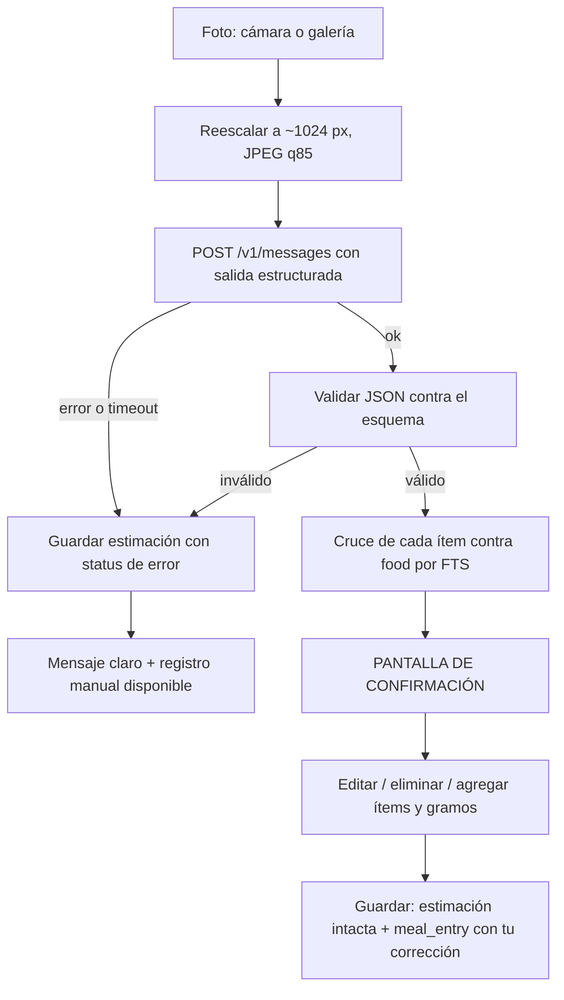

# Módulo de estimación por foto

Diseño del pipeline de visión: prompt, esquema de salida, errores, costo y evaluación.

**Premisa de la que sale todo lo demás:** una foto contiene identidad y no contiene volumen. El modelo puede decir "arroz, pollo y frijoles" con alta fiabilidad y no puede saber si el arroz son 120 g o 220 g, porque la información no está en la imagen. El diseño no intenta arreglar eso: lo asume, lo mide y pone tu corrección en el camino crítico.

Lo que este módulo te ahorra es **tecleo**, no juicio.

---

## Flujo



La pantalla de confirmación no se puede saltar. No existe un camino que escriba un `meal_entry` sin pasar por ella.

---

## La llamada al modelo

**Modelo:** `claude-opus-5`.
**Transporte:** HTTP directo con `dio` desde `data/remote/claude_vision_client.dart`. No existe SDK oficial de Anthropic para Dart, y esa es la vía correcta —no un envoltorio compatible con otra API.

### Forma de la petición

```http
POST https://api.anthropic.com/v1/messages
x-api-key: <desde flutter_secure_storage>
anthropic-version: 2023-06-01
content-type: application/json
```

```jsonc
{
  "model": "claude-opus-5",
  "max_tokens": 4096,
  "system": "<prompt de sistema, versionado>",
  "output_config": {
    "effort": "medium",
    "format": { "type": "json_schema", "schema": { /* ver abajo */ } }
  },
  "messages": [{
    "role": "user",
    "content": [
      { "type": "image",
        "source": { "type": "base64", "media_type": "image/jpeg", "data": "<b64 sin saltos de línea>" } },
      { "type": "text", "text": "Analiza este plato." }
    ]
  }]
}
```

Cuatro notas sobre esa petición:

- **`output_config.format` con `json_schema` es lo que fuerza el JSON**, no un `tool_choice` forzado ni un "responde solo con JSON" en el prompt. La restricción se aplica del lado del servidor y elimina la clase entera de fallos de "el modelo escribió una frase antes del JSON".
- **El pensamiento adaptativo está activo por defecto en Opus 5** y sus tokens se cobran como salida. `effort: "medium"` es el punto correcto para una tarea de extracción: subirlo no mejora una estimación de volumen que la imagen no contiene.
- **No intentes cachear el prompt de sistema.** Ronda los 500 tokens, por debajo del prefijo mínimo cacheable. El ahorro sería cero y la complejidad no.
- **Revisa `stop_reason` antes de leer el contenido.** Si vale `"refusal"`, el cuerpo no trae lo que esperas. Es improbable con fotos de comida, pero cuesta tres líneas y evita un fallo incomprensible. Opcionalmente se activa el respaldo del lado del servidor (`fallbacks`, con su encabezado beta) para que el modelo alterno responda en lugar de fallar; para este caso de uso es prescindible y puede omitirse.

### Antes de enviar: el reescalado

La imagen se reescala a **1024 px de lado largo** en JPEG calidad 85. No es una optimización menor: el costo en tokens de una imagen crece con su área (aproximadamente `ancho × alto / 750`). Una foto de 4032×3024 sin reescalar cuesta unas **16,000 fichas** de entrada; la misma a 1024×768 cuesta unas **1,050**. Quince veces más barata, y con la misma capacidad de identificar el plato: el cuello de botella nunca fue la resolución.

---

## Prompt de sistema, versión `v1`

Se guarda en `app/lib/features/photo/prompts/v1.dart` como constante, y su identificador se escribe en `photo_estimate.prompt_version` en cada llamada. Cuando cambie, se crea `v2` y **no se edita `v1`**: es lo que permite comparar versiones sobre las mismas fotos después.

```text
Eres un asistente de análisis nutricional. Recibes la foto de un plato de comida y
devuelves los alimentos que identificas, con una estimación de la porción en gramos.

Contexto: el usuario está en México. Es probable que aparezcan alimentos y platillos
mexicanos (tortillas de maíz, frijoles de la olla, nopales, salsas, guisados). Nómbralos
con el término mexicano en `label_es`.

Reglas:

1. Enumera únicamente los alimentos que puedes ver. No infieras ingredientes ocultos de
   un guiso salvo que sean obvios y visibles. Si algo no se distingue, no lo inventes.

2. Para cada alimento devuelve:
   - `label_es`: cómo lo llamaría un mexicano ("frijoles de la olla", "pechuga asada").
   - `label_en`: el término genérico en inglés que usarías para buscarlo en una base
     nutricional estadounidense ("cooked pinto beans", "grilled chicken breast"). Este
     campo sirve para el cruce automático; que sea genérico importa más que sea elegante.
   - `preparation`: método de cocción si es visible (asado, frito, hervido, crudo).
   - `estimated_grams`: tu mejor estimación puntual de la porción servida, en gramos.
   - `grams_range_low` y `grams_range_high`: un intervalo que a tu juicio contenga el
     valor real. Que sea honesto, no estrecho.
   - `confidence`: entre 0 y 1, tu confianza en la IDENTIFICACIÓN del alimento (no en
     los gramos).
   - `basis`: en una frase, qué referencia de escala usaste para estimar la porción
     ("el plato aparenta unos 26 cm", "comparado con el tenedor a un costado"). Si no
     hay ninguna referencia de escala en la imagen, dilo explícitamente.

3. Sobre las porciones: una fotografía no contiene información de volumen ni de densidad.
   Tu estimación de gramos es una aproximación a partir del área visible y de referencias
   de escala. Cuando no haya referencia de escala, amplía el intervalo en lugar de fingir
   precisión. Un intervalo ancho y honesto es más útil que un número estrecho e inventado.

4. Si la imagen no es comida, o la calidad impide identificar nada, devuelve `items` vacío
   y el `image_quality` correspondiente.

5. No sumes calorías ni macros. El cálculo nutricional lo hace la aplicación con su propia
   base de datos. Tu trabajo es identificar y estimar la cantidad.
```

La regla 5 no es un detalle. Que el modelo no calcule calorías elimina una fuente entera de error compuesto: si estimara mal los gramos *y* usara sus propios valores nutricionales de memoria, tendrías dos errores multiplicándose y ninguna forma de separarlos. Así, la parte incierta (gramos) queda aislada y medible, y la parte determinista (macros por gramo) sale de una base de datos que puedes auditar.

---

## Esquema JSON de salida

```json
{
  "type": "object",
  "additionalProperties": false,
  "required": ["image_quality", "items", "overall_notes"],
  "properties": {
    "image_quality": {
      "type": "string",
      "enum": ["good", "poor", "not_food"]
    },
    "items": {
      "type": "array",
      "maxItems": 20,
      "items": {
        "type": "object",
        "additionalProperties": false,
        "required": ["label_es", "label_en", "estimated_grams",
                     "grams_range_low", "grams_range_high", "confidence", "basis"],
        "properties": {
          "label_es":         { "type": "string", "maxLength": 80 },
          "label_en":         { "type": "string", "maxLength": 80 },
          "preparation":      { "type": "string", "maxLength": 40 },
          "estimated_grams":  { "type": "number", "minimum": 0, "maximum": 3000 },
          "grams_range_low":  { "type": "number", "minimum": 0, "maximum": 3000 },
          "grams_range_high": { "type": "number", "minimum": 0, "maximum": 3000 },
          "confidence":       { "type": "number", "minimum": 0, "maximum": 1 },
          "basis":            { "type": "string", "maxLength": 200 }
        }
      }
    },
    "overall_notes": { "type": "string", "maxLength": 500 }
  }
}
```

### Validación en Dart, además del esquema

El esquema lo garantiza el servidor, pero la app valida de nuevo antes de escribir en la base. Es barato y es la frontera donde se queda un dato malo:

| Comprobación | Acción si falla |
|---|---|
| El JSON parsea | `status = 'parse_error'`, se guarda el cuerpo crudo |
| `grams_range_low <= estimated_grams <= grams_range_high` | Se corrige el intervalo al mínimo que contenga el punto; se anota |
| `estimated_grams > 0` | El ítem se descarta con aviso |
| `confidence ∈ [0,1]` | Se recorta al rango |
| `items` no vacío cuando `image_quality = 'good'` | Se muestra "no se identificó nada"; no es un error |
| Longitud de etiquetas razonable | Se trunca |

Esta es la lógica que pediste probar explícitamente. Vive en `domain/services/photo_estimate_parser.dart`, es Dart puro y no toca ni red ni base de datos, así que sus pruebas son una tabla de casos con JSON literal.

---

## Cruce con la base nutricional

Cada ítem se busca en `food` por FTS usando `label_en` (la base es de USDA, en inglés) y, si falla, `label_es` contra `name_es`. El mejor resultado se propone preseleccionado con su `match_score`.

Lo que se guarda —y esto importa para la evaluación— es **cómo se emparejó** (`match_method`: `fts`, `manual` o `none`) y con qué puntaje. Así puedes medir después si tus correcciones vienen de que el modelo estimó mal o de que el cruce eligió mal el alimento. Son dos fallos distintos con dos soluciones distintas, y sin esta columna se confunden.

---

## Errores, timeouts y reintentos

| Situación | Comportamiento | ¿Reintento? |
|---|---|---|
| Sin API key configurada | El módulo no aparece en la UI | — |
| Sin conexión | Mensaje inmediato, sin llamada | No |
| Timeout (60 s) | `status = 'timeout'` | Uno, con 2 s de espera |
| 429 (límite de tasa) | `status = 'api_error'` | Hasta 2, respetando `retry-after` |
| 5xx | `status = 'api_error'` | Hasta 2, con espera exponencial |
| 401 / 403 | "Revisa tu API key en Ajustes" | **No** |
| 400 | `status = 'api_error'`, se guarda el cuerpo | **No** |
| `stop_reason = "refusal"` | `status = 'api_error'` con la categoría | No |
| JSON inválido | `status = 'parse_error'`, cuerpo crudo guardado | No |

Tres reglas transversales:

1. **Un fallo nunca bloquea el registro manual.** El botón de "registrar a mano" está en la misma pantalla del error. La app funciona completa sin este módulo; ese es el punto de que sea la Fase 4.
2. **Los reintentos son acotados y visibles.** Reintentar en bucle es gastar dinero sin avisar.
3. **Cada intento fallido se guarda igual** en `photo_estimate`. Los fallos también son datos: una tasa de `parse_error` distinta de cero te dice algo sobre el prompt.

---

## Costo por foto

Precios de Opus 5: **$5 USD por millón de fichas de entrada, $25 por millón de salida.**

| Componente | Fichas | Costo |
|---|---|---|
| Imagen 1024×768 (≈ `ancho × alto / 750`) | ~1,050 | |
| Prompt de sistema + texto del usuario | ~500 | |
| **Entrada total** | **~1,550** | **$0.0078** |
| Razonamiento adaptativo (effort `medium`) | ~800 | |
| JSON de salida (4-6 ítems) | ~400 | |
| **Salida total** | **~1,200** | **$0.0300** |
| **Total por foto** | | **≈ $0.038 USD** |

Rango realista según complejidad del plato: **$0.03 – $0.05 USD por foto**.

| Uso | Fotos/mes | Costo mensual |
|---|---|---|
| Una comida al día | 30 | ~$1.15 |
| Tres comidas al día | 90 | ~$3.40 |
| Uso intensivo | 200 | ~$7.60 |

La pantalla de ajustes muestra el acumulado del mes, calculado con los tokens que la propia API reporta en `usage` —no con esta estimación—. Eso convierte el costo en un dato observado y, de paso, valida esta tabla contra la realidad.

**El costo no debe ser el criterio para elegir modelo aquí.** Un modelo más barato es tentador, pero lo que quieres saber es si estima igual de bien, y eso se responde midiendo sobre tus propias fotos, no suponiendo. Ver la sección siguiente.

---

## Evaluación: medir qué tan bien estima el modelo

Esta es la parte que convierte el módulo en material de portafolio. Cada foto que corriges produce una fila etiquetada por ti. Las métricas salen de consultas SQL sobre el export.

### Métricas

**1. Identificación — precisión y exhaustividad**

```
precisión     = (accepted + edited) / (accepted + edited + removed)
exhaustividad = (accepted + edited) / (accepted + edited + added)
```

`removed` son alucinaciones (dijo algo que no estaba); `added` son omisiones (no vio algo que sí estaba). Es una matriz de confusión con nombres de comida.

**2. Estimación de porción — el número que de verdad importa**

Solo sobre los ítems que conservaste (`accepted` y `edited`):

- **MAE en gramos**: `mean(|model_grams − final_grams|)`
- **Error porcentual absoluto medio**: `mean(|model_grams − final_grams| / final_grams)`
- **Sesgo**: `mean(model_grams − final_grams)`. Si sale sistemáticamente positivo, el modelo sobreestima porciones y basta con un factor de corrección. Un sesgo constante es una noticia buena: se calibra. El ruido sin sesgo no.

**3. Cobertura del intervalo**

Qué fracción de tus valores reales cae dentro de `[grams_range_low, grams_range_high]`. Si el modelo estuviera bien calibrado rondaría el 80-90 %. Si sale mucho menor, sus intervalos son demasiado optimistas y hay que decírselo en el prompt `v2`. Esto es calibración de incertidumbre, y es exactamente lo que se espera medir en un sistema con LLM.

**4. Calibración de la confianza**

Agrupa los ítems por tramos de `confidence` (0.5-0.6, 0.6-0.7, …) y compara con la tasa real de acierto en cada tramo. Un modelo calibrado dice 0.8 y acierta el 80 % de las veces.

**5. Error a nivel plato**

El que se nota en el uso: `|kcal_estimadas − kcal_finales| / kcal_finales` por foto. Es el número que responde "¿me sirve de algo esto?".

**6. Operación**

Latencia p50/p95, tasa de `parse_error`, costo promedio por foto, y cuántos ítems tuviste que corregir por foto (la métrica de fricción real).

### La consulta base

```sql
SELECT
    e.id                AS estimate_id,
    e.model_id,
    e.prompt_version,
    i.model_label,
    i.model_grams,
    i.model_confidence,
    i.user_action,
    i.final_grams,
    i.match_method,
    i.match_score,
    (i.model_grams - i.final_grams)                       AS error_g,
    ABS(i.model_grams - i.final_grams) / i.final_grams    AS error_rel
FROM photo_estimate_item i
JOIN photo_estimate e ON e.id = i.estimate_id
WHERE e.status = 'ok'
  AND i.user_action IN ('accepted', 'edited');
```

El resto vive en `tools/analysis/photo_eval.ipynb`, que lee el export con pandas.

### Comparar modelos, de forma honesta

Con veinte o más fotos etiquetadas tienes un conjunto de evaluación propio. Ahí sí tiene sentido preguntarse si un modelo más barato basta:

1. Guardas las imágenes originales junto con tus correcciones.
2. Reejecutas el mismo prompt `v1` con otro modelo sobre las **mismas** fotos, desde un script de Python en `tools/` (no desde la app).
3. Comparas MAE, cobertura del intervalo y tasa de identificación contra las mismas etiquetas.
4. Cambias de modelo si los números lo sostienen, y anotas el resultado en un ADR.

Eso es una decisión medida. "Uso el más barato" es una suposición, y la diferencia entre ambas cosas es precisamente lo que un portafolio de AI Engineering debería demostrar.

Lo mismo aplica al prompt: `v2` contra `v1` sobre el mismo conjunto. Por eso `prompt_version` se guarda en cada fila.

---

## Seguridad

| Riesgo | Control |
|---|---|
| API key en el repo o en el APK | Se captura en Ajustes y vive en `flutter_secure_storage` (Keystore de Android). Prueba de Fase 4: descomprimir el APK y hacer `grep` de la llave — no debe aparecer. |
| Key en logs o en reportes de fallo | El cliente HTTP redacta el encabezado `x-api-key` en todo log. `raw_response` se guarda, la petición con la llave no. |
| Fotos de comida almacenadas indefinidamente | Retención configurable de las últimas N imágenes. Las filas de estimación se conservan siempre: pesan poco y son el dataset. |
| Salida del modelo tratada como confiable | Se valida contra el esquema y luego en Dart antes de tocar la base. Nada de lo que devuelve el modelo se interpola en SQL ni en una ruta de archivo; se escribe por parámetros. |
| Imágenes enviadas a un tercero | Es inherente al módulo y se dice explícitamente en la pantalla de ajustes: las fotos se envían a la API de Anthropic para su análisis. Ningún otro módulo de la app sale a internet con datos tuyos. |

---

## Qué haría falta para que esto fuera bueno de verdad

Anotado para no confundir el alcance con el potencial:

- **Una referencia de escala en la foto.** Poner siempre el mismo tenedor o una tarjeta en el encuadre reduciría el error de porción más que cualquier cambio de prompt o de modelo. Es un cambio de hábito, no de software, y probablemente el de mejor relación esfuerzo/beneficio.
- **Dos fotos desde ángulos distintos** darían algo parecido a profundidad.
- **Una báscula.** Si de verdad te importa la precisión, pesar es correcto y esto es una aproximación. Este módulo es para cuando no vas a pesar: come afuera, con prisa, o simplemente no quieres.
- **Ajuste con tus propios datos.** Tras unos meses, tus correcciones permiten calcular factores de corrección por tipo de alimento ("el modelo subestima los frijoles un 30 %") y aplicarlos antes de mostrar la estimación. Eso es un modelo de corrección entrenado con tus datos, encima de un modelo general — y es un caso de estudio mucho más interesante que la feature original.
